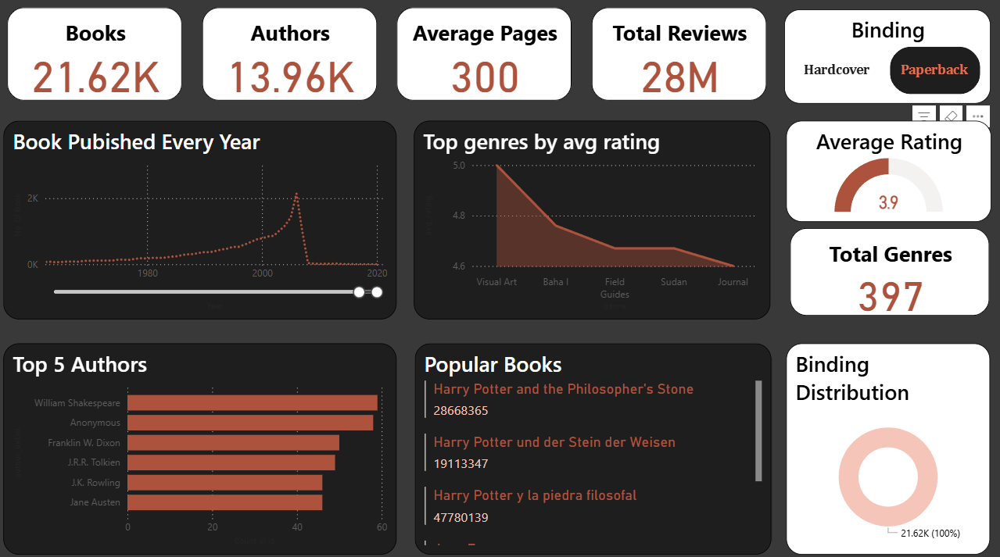

# 📚 Goodreads Data Analysis Project  

This project focuses on analyzing **Goodreads book dataset** using **SQL** and **Power BI**.  
It provides insights into books, authors, genres, and publishing trends through SQL queries and an interactive Power BI dashboard.  

---

## 📂 Project Structure

Goodreads-Analysis/
│

├── Dataset/

│ ├── Good_read_cleaned.csv # Cleaned dataset for analysis

│ ├── good_read.csv # Raw dataset

│ └── readme.txt # Dataset description

│

├── SQL/

│ ├── Good_read_Ques_answer.sql # SQL queries with solutions

│ ├── Questions.sql # SQL questions only

│ └── readme.txt # SQL analysis description
│

├── Power BI/

│ ├── Good_read_dark.pbix # Power BI dashboard file

│ └── readme.txt # Dashboard description
│

├── Visual/

│ ├── Good_read_visual.png # Dashboard preview

│ └── readme.txt # Visual description
│

└── README.md # Project Documentation

---

## 🗄️ Dataset  

- Contains book details such as:
  - **Book ID, Title, Author, Genre, Pages, Binding**
  - **Ratings, Reviews**
  - **Publication Date**
- Size: ~21K books, 13.9K authors, 28M reviews.

---

## 🧑‍💻 SQL Analysis  

Key SQL queries include:  
- Top-rated books and authors.  
- Most reviewed books per genre.  
- Publishing trends over time.  
- Genre distribution analysis.  
- Average ratings per binding type.  

📌 See detailed queries and answers in:  
`SQL/Good_read_Ques_answer.sql`

---

## 📊 Power BI Dashboard  

The **Power BI report** (`Power BI/Good_read_dark.pbix`) provides an interactive view of the dataset.  

### Key Insights:
- **Total Books:** 21.62K  
- **Authors:** 13.96K  
- **Average Pages:** 300  
- **Total Reviews:** 28M  
- **Average Rating:** 3.9  
- **Genres Covered:** 397  

### Visualizations:
- Books published per year 📈  
- Top genres by average rating 📊  
- Binding type distribution 🔖  
- Popular books & top authors ⭐  
- Average rating gauge 🎯  

📌 Dashboard Preview:  

---

## 🚀 How to Use  

1. **SQL Analysis**  
   - Import dataset into a SQL database.  
   - Run queries from `SQL/Questions.sql` or `SQL/Good_read_Ques_answer.sql`.  

2. **Power BI**  
   - Open `Power BI/Good_read_dark.pbix` in Power BI Desktop.  
   - Explore interactive dashboard.  

---

## 🔮 Future Work  

- Add machine learning models for rating predictions.  
- Advanced NLP analysis of book reviews.  
- Integration with web-based dashboards (e.g., Streamlit, Tableau).  

---

## 👨‍💻 Author  

**Suraj Singh**  
- Skills: SQL | Power BI | Python | Data Analysis | Excel  
- 📧 Contact: suraj15506@gmail.com  
